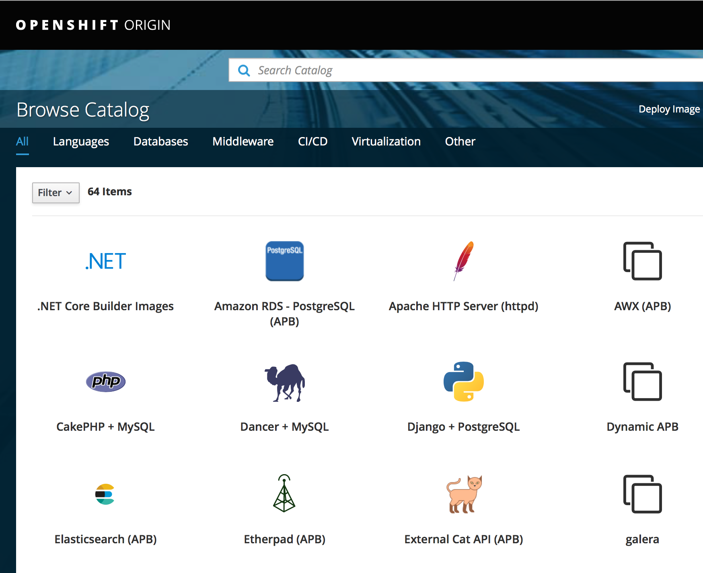
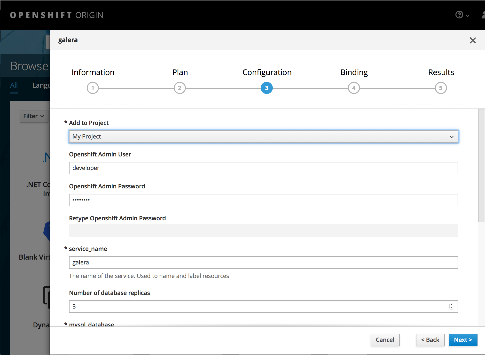

galera-apb
===============

An Ansible Playbook Bundle (APB) to deploy a [Galera Cluster for MySQL](http://galeracluster.com).

## What it does
* It deploys a Galera server using a [derived CentOS image](https://github.com/beekhof/galera-container/blob/master/Dockerfile)

## Requirements
* N/A

## Parameters

* mysql_database: MySQL database name (default: 'sample')
* mysql_password: MySQL database password (default: 'admin')
* mysql_user: MySQL database username (default: 'admin')
* volume_size: size of the PVC to request if persistent storage is requested (default: '1 Gi')
* service_name: name of the service, used for names and labels of provisioned resources (default: 'galera')
* service_replicas: number of database replicas (default: 3)
* admin_user: Openshift Admin User (default: 'developer')
* admin_password: Openshift Admin Password (default: 'password')

### Environment variables

For convenience, the parameters above can be set/overriden via environment variables on the APB container. The environment variable names are the same in all upper case letters; for example, you can specify the `mysql_database` parameter via the `MYSQL_DATABASE` environment variable.

## Plans

There are 2 plans available:

* Ephemeral (default): deploys 3 Galera MySQL replicas with ephemeral storage, i.e. no storage persistence: when the container stops its data is lost.
* Persistent: deploys 3 Galera MySQL replicas with persistent storage. The storage is allocated via a Persistent Volume Claim of `volume_size`.

## How to use:

#### CLI Deployment from a Service Catalog

1) Edit ```templates/galera-apb.yml``` and set ```admin_user``` and ```admin_password``` credentials that have cluster-admin permission.
2) Deploy from command line:

```
kubectl create -f templates/galera-apb.yml
```

#### UI Deployment from a Service Catalog







## Manual Deployment without a Service Catalog

Obtain the [image](https://hub.docker.com/r/ansibleplaybookbundle/galera-apb):

    docker pull ansibleplaybookbundle/galera-apb

When creating the container, you need to provide the OpenShift API URL and authentication token:

    docker run --rm --net=host -v $HOME/.kube:/opt/apb/.kube:z -u $UID ansibleplaybookbundle/galera-apb provision

You can pass additional parameters to `ansible-playbook` by adding them at the end; for example, you can request more verbose output with one or more `-v` and pass additional variables with `--extra-vars`.

For example, this will request a *persistent* plan and specify a custom database name and volume size:

    docker run --rm --net=host -v $HOME/.kube:/opt/apb/.kube:z -u $UID ansibleplaybookbundle/galera-apb provision \
       --extra-vars mysql_database=production --extra-vars _apb_plan_id=persistent --extra-vars volume_size=2Gi

## Tearing down the application

    docker run --rm --net=host -v $HOME/.kube:/opt/apb/.kube:z -u $UID ansibleplaybookbundle/galera-apb deprovision

## References

- [APB Doc Repo](https://github.com/ansibleplaybookbundle/ansible-playbook-bundle)
- [APB Base Repo](https://github.com/ansibleplaybookbundle/apb-base)
